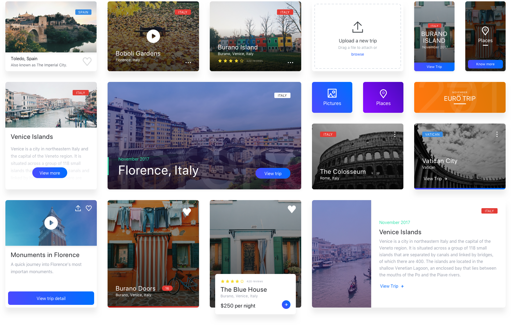
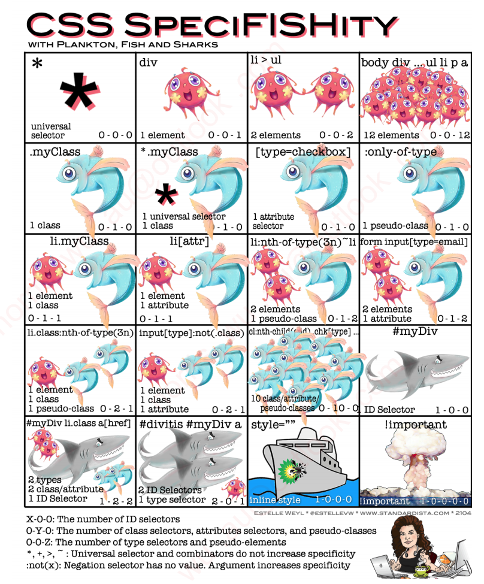
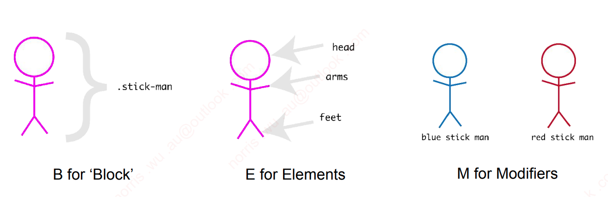

[回到目录](../../README.md)

<hr>
<hr>
<br>

# | CSS - Cascading Style Sheets - Part 2 |

## [00:11:00] Card

Card 是十分常见的 web element，通常都以 component 的形式出现。但现阶段的学习还未涉及 component，所以我们用 plain html 编写 card element。



## [00:14:00] Styling Sheet 优先级

### Style from top to bottom

浏览器在读取 css 文件时会从上往下读取，如果在同一个文件冲出现重复的 class selector，那么浏览器会优先采用后者的 class selector properties。

```css
/* Line 1 */
.container {
  background: #000000;
}

/* Line 666 */
.container {
  background: #ffffff;
}
```

Line 666 的 `.container` class 会覆盖 line 1 的 `.container` class。

### Style from different source

优先级（由高到低）

1. Author Stylesheet - 开发编写的 Stylesheets
2. User Stylesheet - Normalize.css || Browser Extensions
3. Default Stylesheet - 浏览器默认

## [00:20:00] CSS Reset - 面试点

使用外部 css 文件，[normalize.css](https://necolas.github.io/normalize.css/), 会在浏览器加载时，统一浏览器默认的样式数值。

- 安装方式: `npm install normalize.css`

> ```css
> /* Normalize.css 例子 */
>
> html {
>   line-height: 1.15;
>   -webkit-text-size-adjust: 100%;
> }
>
> body {
>   margin: 0;
> }
> ```

相对暴力的方式可以使用[CSS tools: Reset CSS - by Eric Meyer](https://meyerweb.com/eric/tools/css/reset/)，这个工具会将所涉及到的元素的指定样式设定归零。

> ```css
> /* Reset CSS 例子*/
> html,
> body {
>   margin: 0;
>   padding: 0;
>   border: 0;
>   font-size: 100%;
>   font: inherit;
>   vertical-align: baseline;
> }
> ```

**Q.** 为什么不用 `*` Universal Selector 来重置所有元素？

**A.** 不用 universal selector 的好处在于，Reset CSS 能 explicitly reset 特定元素。这样开发能更精准的掌控被重置的元素。

## [00:22:40 - 00:32:30] CSS Selector Specificity - 优先级

优先级高的设置会覆盖上一级的设置，selector 越详细，优先级越高。



| 低优先 | 高优先 |
| :----: | :----: |
|  Left  | Right  |
|  Top   | Bottom |

[参考文件](https://github.com/NorrisWu0/JRAcademy-FullStack-T14/blob/lectures/lecture-03-css-scss/course-materials/l03_css_scss/css%20-%20specificity.pdf)

## [00:31:30] BEM - Block Element Modifier



```css
/* Block */

.stick-man {
}

/* Element */

.stick-man__head {
}
.stick-man__arms {
}
.stick-man__feet {
}

/* Modifier */

.stick-man_blue {
}
.stick-man_red {
}
```

<br>
<hr>
<hr>

## _[Switch to [Responsive Web Design](03_responsiveDesign.md)]_
